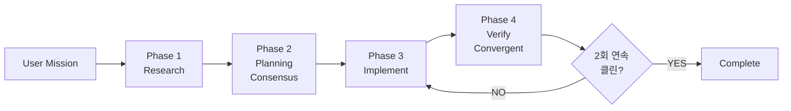
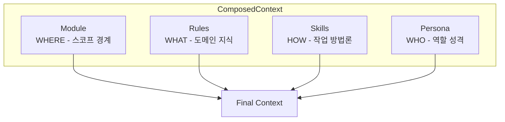
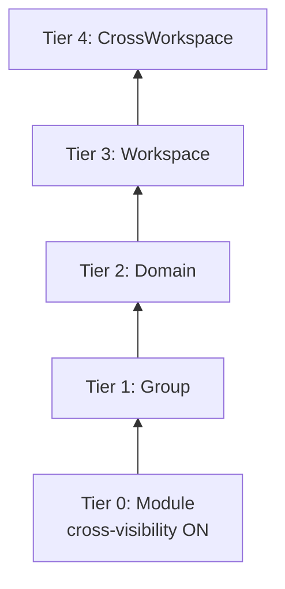
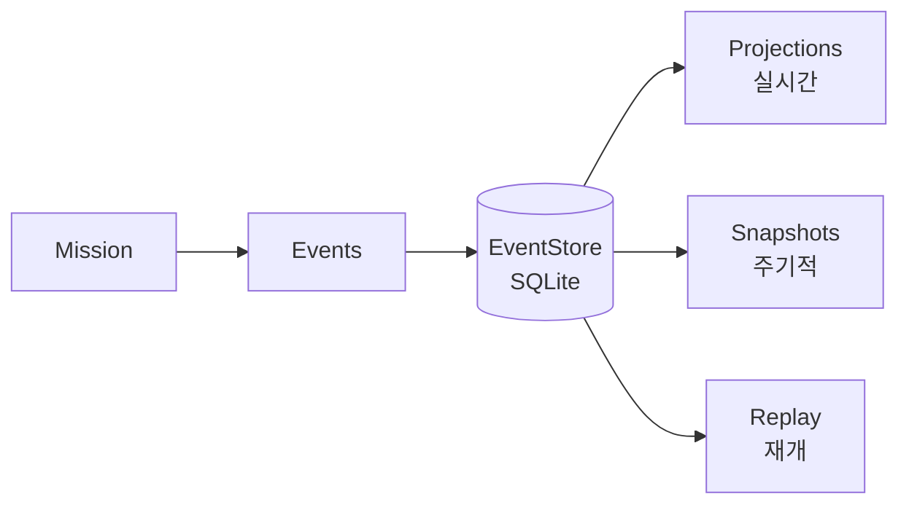

# Claude-Pilot

AI 코딩 오케스트레이터 - 증거 기반 계획과 수렴적 검증으로 LLM 한계를 보완합니다.

---

## 설계 철학

### 목표: 검증될 때까지 완료 아님

> 2회 연속 심층 리뷰에서 이슈 0건일 때만 완료.

1. 반복적 개선으로 미션 완수
2. 2회 연속 클린 라운드로 철저히 검증
3. 막히면 에스컬레이션 후 재개

### 범용성

모든 환경에서 동작해야 함:
- **모든 언어**: Rust, Python, Go, Java, TypeScript, Ruby, PHP, C++ 등
- **모든 프레임워크**: React, Django, Spring, Rails, Express 등
- **모든 구조**: 모노레포, 폴리글랏, 마이크로서비스, 라이브러리

**중요**: 특정 언어/프레임워크/구조를 가정하는 로직은 실패함.

---

## 핵심 원칙: Programmatic vs LLM

### 트레이드오프

| Programmatic | LLM |
|-------------|-----|
| ✓ 빠름, 결정적, 토큰 비용 없음 | ✓ 모호성과 다양한 컨텍스트 처리 |
| ✗ 잘못된 정보로 LLM 혼란 가능 | ✓ 미지의 언어/프레임워크 적응 |
| ✗ LLM 판단력 제한 가능 | ✗ 토큰 비용, 지연 |

### 결정 프레임워크

```
Programmatic으로 해야 하나?

1. 결정적인가? (같은 입력 → 항상 같은 출력)
   NO  → LLM 사용
   YES ↓

2. 범용적인가? (모든 언어/프레임워크/프로젝트에서 동작)
   NO  → LLM 또는 2단계 접근
   YES ↓

3. 틀리면?
   조용한 실패 / 잘못된 데이터 → 사용 금지 (LLM에 맡김)
   약간의 비효율만 → 사용 OK
```

---

## 안전한 패턴 vs 위험한 패턴

### 안전: 범용 시그널

| 시그널 | 이유 |
|--------|------|
| 파일 존재 여부 | Filesystem API, 언어 무관 |
| 파일 수정 (mtime + size) | OS 레벨, 결정적 |
| HTTP 상태 코드 (429, 404, 502) | RFC 정의 |
| Exit code 0 vs non-zero | POSIX 표준 |
| 마커 파일 (Cargo.toml, package.json) | 스펙 정의 |
| 수학적 수렴 (N회 클린 라운드) | 순수 로직 |

### 위험: 컨텍스트 의존

| 패턴 | 문제 |
|------|------|
| 디렉토리명 (`build`, `dist`, `target`) | 프로젝트마다 의미 다름 |
| "Test" 감지 | 프레임워크마다 다름 |
| 에러 메시지 키워드 | 영어 전용, 포맷 다양 |

**규칙**: 도메인 지식이 해석에 필요하면 → LLM 사용.

---

## 안티패턴 (반드시 피할 것)

### 1. 과신하는 Programmatic 로직

```rust
// BAD: "target"이 항상 Rust 출력은 아님
if dir_name == "target" { skip_directory(); }

// GOOD: ".git"은 범용적으로 안전
if dir_name == ".git" { skip_directory(); }
```

### 2. 영어 키워드 매칭

```rust
// BAD: 영어 툴체인만 동작
if message.contains("error") { ... }

// GOOD: 에러 코드 사용 (언어 무관)
if let Some(code) = extract_error_code(message) { ... }
```

### 3. 해석된 데이터 대신 원본

```rust
// BAD: 정보 손실, 잘못된 해석 가능
prompt = "Build failed due to type error"

// GOOD: 원본 데이터 제공
prompt = format!("Exit code: {}\nOutput:\n{}", exit_code, raw_output)
```

### 4. 에이전트 결과 추측

```rust
// BAD: 확인 없이 성공 가정
let result = agent.execute(task).await;
proceed_to_next_phase();

// GOOD: 항상 결과 상태 확인
let result = agent.execute(task).await?;
match result.status {
    TaskStatus::Success => proceed_to_next_phase(),
    TaskStatus::Deferred => add_to_retry_queue(task),
    TaskStatus::Failed => handle_failure(result.error),
}
```

---

## 아키텍처 개요

### 실행 흐름



### 핵심 컴포넌트

| 컴포넌트 | 용도 |
|---------|------|
| `MissionOrchestrator` | Manifest 기반 미션 생명주기 관리 |
| `Coordinator` | 멀티 에이전트 워크플로우 조율 |
| `AdaptiveConsensusExecutor` | 전략 선택 (direct/flat/hierarchical) |
| `AgentPool` | 멀티 인스턴스 에이전트 관리 |
| `AgentMessageBus` | P2P 메시징 + 이벤트 스토어 연동 |
| `FileOwnershipManager` | 병렬 편집 충돌 방지 + deferred queue |
| `EventStore` | 내구성 이벤트 저장, replay/resume (SQLite) |
| `ConvergentVerifier` | 2-pass 수학적 수렴 |
| `ConflictResolver` | P2P 충돌 해결 (결정적 yield) |
| `ContextComposer` | Module → Rules → Skills 컨텍스트 합성 |

### 에이전트 역할

| 에이전트 | 역할 | Phase |
|---------|------|-------|
| `ResearchAgent` | 증거 수집, 코드베이스 분석 | 1 |
| `PlanningAgent` | 작업 분해, 합의 참여 | 2 |
| `CoderAgent` | 구현, P2P 충돌 처리 | 3 |
| `VerifierAgent` | Build/Test/Lint 검증 | 4 |
| `ReviewerAgent` | 코드 품질 리뷰 | 4 |
| `ArchitectAgent` | 설계 검증 조언자 | All |
| `ModuleAgent` | 모듈별 전문성 (스코프 강제) | 2-3 |

### 컨텍스트 합성 패턴



---

## 멀티 에이전트 합의

### 계층형 합의 Tier



### 합의 전략 선택

| 참여자 수 | 전략 |
|----------|------|
| 1-3 | Direct 실행 (투표 없음) |
| 4-10 | Flat 합의 (단일 라운드) |
| 11+ | Hierarchical 합의 (tier 기반) |

### P2P 메시지 타입

| 메시지 | 용도 |
|--------|------|
| `ConsensusRequest` | 합의 시작 브로드캐스트 |
| `ConsensusVote` | 에이전트 투표 → 코디네이터 |
| `ConflictAlert` | 파일 충돌 감지 브로드캐스트 |
| `EvidenceShare` | 연구 결과 공유 |
| `TaskResult` | 작업 완료 보고 |
| `TaskAssignment` | 특정 에이전트에 작업 할당 |

---

## 핵심 타입 레퍼런스

### ConsensusResult

```rust
pub enum ConsensusResult {
    Agreed { plan, tasks, rounds, respondent_count },      // 완전 합의
    PartialAgreement { plan, dissents, unresolved },       // 과반 합의
    NoConsensus { summary, blocking_conflicts },           // 합의 실패
}
```

### TaskStatus

```rust
pub enum TaskStatus {
    Pending,      // 미시작
    InProgress,   // 실행 중
    Success,      // 성공
    Failed,       // 실패
    Deferred,     // 충돌로 yield, 나중에 재시도
    Skipped,      // 스킵 (의존성 실패)
}
```

### Agent ID 컨벤션

```
코어 에이전트:   {role}-{instance}   → research-0, coder-1
모듈 에이전트:   module-{id}         → module-auth, module-database
코디네이터:     {tier}-{id}          → group-backend, domain-api
```

---

## 이벤트 소싱



### 주요 이벤트

| 이벤트 | Aggregate | 용도 |
|--------|-----------|------|
| `MissionStarted` | Mission | 미션 시작 |
| `ConsensusRoundStarted` | Consensus | 합의 라운드 추적 |
| `TierConsensusCompleted` | Consensus | 계층 tier 결과 |
| `TaskCompleted` | Task | 작업 완료 |
| `VerificationRoundCompleted` | Verification | 수렴 검증 |
| `CheckpointCreated` | Session | 재개용 체크포인트 |

---

## 설정

### 변경 불가 설정

품질 보장의 핵심 - 반드시 적용:

```toml
[recovery.convergent_verification]
required_clean_rounds = 2      # 반드시 >= 2
include_ai_review = true       # 반드시 true

[quality]
min_evidence_quality = 0.6     # 반드시 >= 0.5
require_verifiable_evidence = true  # 반드시 true
```

### 주요 설정

```toml
[orchestrator]
max_iterations = 100
mission_timeout_secs = 604800  # 7일

[multi_agent]
enabled = true
parallel_execution = true

[multi_agent.consensus]
max_rounds = 5
enable_cross_visibility = true
flat_threshold = 3             # <= 이하 → direct/flat
hierarchical_threshold = 10    # > 초과 → hierarchical

[state]
database_path = ".pilot/events.db"
enable_snapshots = true
```

---

## 개발 규칙

### 1. Use First (변경 불가)

모듈 구현 시 반드시 같은 변경에서 시스템에 연결:
- 모든 새 모듈은 통합 코드 필수
- `cargo test`가 새 코드 경로 실행해야 함
- 미사용 `pub` export는 버그

### 2. 휴리스틱보다 LLM 신뢰

의심될 때:
- 틀릴 수 있는 하드코딩 → LLM
- 빠르지만 부정확할 수 있음 → 캐싱과 함께 LLM
- "이 패턴이 동작할 것 같다" → 5개 이상 언어에서 먼저 검증

### 3. 원본 데이터 보존

LLM 폴백을 위해 항상 원본 데이터 접근 가능하게 유지.
LLM이 필요로 할 수 있는 정보 절대 버리지 않기.

### 4. Manifest 우선 설계

에이전트 계층은 반드시 manifest에서 파생:
- `.claudegen/manifest.json`이 프로젝트 구조 정의
- 모듈, 그룹, 도메인, 워크스페이스
- manifest 구조에서 합의 tier 구축

### 5. 내구성을 위한 이벤트 소싱

모든 중요한 상태 변경은 이벤트 발행:
- 모든 체크포인트에서 replay/resume 가능
- 감사 추적 제공
- 장기 실행 미션 지원 (7일 이상)

---

## AI 코딩 퀵 레퍼런스

### DO

- ✅ 다음 phase 전 `TaskStatus` 확인
- ✅ 일관된 네이밍을 위해 `AgentId::*` 생성자 사용
- ✅ 상태 변경 시 `EventStore`로 이벤트 발행
- ✅ 동시 파일 접근에 `FileOwnershipManager` 사용
- ✅ `TaskStatus::Deferred` 재시도 메커니즘 지원
- ✅ `AgentTaskResult`에 원본 출력 보존

### DON'T

- ❌ 영어 전용 에러 메시지 가정
- ❌ 디렉토리 패턴 하드코딩 (build, dist, target)
- ❌ `required_clean_rounds = 2` 검증 생략
- ❌ `Deferred` 상태 무시 (작업 손실 발생)
- ❌ 미사용 `pub` export 생성
- ❌ LLM 전달 전 데이터 해석
- ❌ 중요 상태 변경에 이벤트 발행 생략

### 공통 패턴

```rust
// 패턴: Deferred 작업 처리
if result.status == TaskStatus::Deferred {
    deferred_queue.push(task);
    // 파일 소유권 해제 시 재시도됨
}

// 패턴: 이벤트 발행
event_store.append(DomainEvent::new(
    AggregateId::consensus(session_id),
    EventPayload::ConsensusRoundCompleted { ... }
)).await?;

// 패턴: 파일 소유권
let guard = ownership_manager.acquire(file_path, agent_id).await?;
// ... 작업 ...
drop(guard);  // 자동 소유권 해제
```

---

## 버전

- Rust Edition: 2024
- MSRV: 1.92.0
