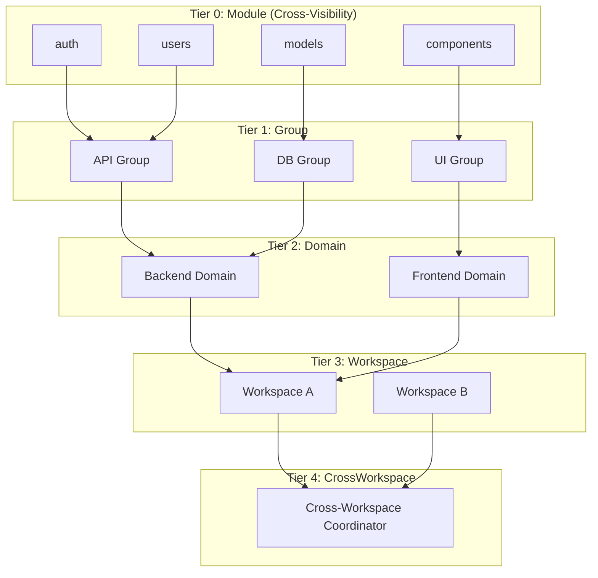
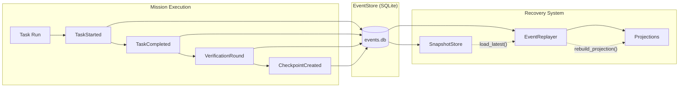
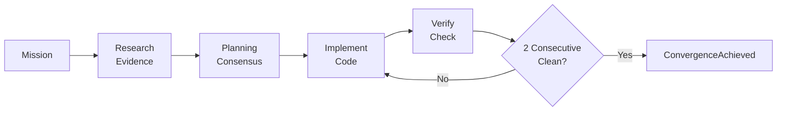

# Claude-Pilot

[](https://github.com/junyeong-ai/claude-pilot/actions)
[](https://www.rust-lang.org)
[](LICENSE)

> **English** | **[한국어](README.md)**

**AI Coding Orchestrator** — Multi-agent consensus protocol and event sourcing ensure "done" actually means done.

---

## Why Claude-Pilot?

- **Quality Guaranteed** — 2 consecutive clean rounds required (build/test/lint/review)
- **Consistency** — Hierarchical consensus protocol coordinates multi-agent planning
- **Durability** — Event sourcing enables instant resume from any checkpoint

---

## Quick Start

```bash
# Install
git clone https://github.com/junyeong-ai/claude-pilot.git
cd claude-pilot && cargo install --path .

# Initialize project
cd your-project
claude-pilot init

# Run mission
claude-pilot mission "Add user authentication"
```

---

## Core Architecture

### Multi-Agent Consensus Protocol



**Consensus Results (ConsensusResult):**
- `Agreed` — Full consensus achieved, plan finalized
- `PartialAgreement` — Majority agreed, dissents recorded, proceed
- `NoConsensus` — Failed to agree, escalate to higher tier

---

### Event Sourcing Based Replay/Resume



**Key Events:**
| Event | Description |
|-------|-------------|
| `MissionCreated` | Mission started |
| `ConsensusRoundStarted` | Consensus round begins |
| `TierConsensusCompleted` | Tier-level consensus done |
| `TaskCompleted` | Task execution done |
| `VerificationRound` | Verification round result |
| `CheckpointCreated` | Checkpoint saved |
| `SessionRecoveryStarted` | Session recovery begins |

---

### Execution Flow



**4 Phases:**
1. **Research** — `EvidenceGatheringStarted` → `EvidenceFileDiscovered` → `EvidenceGatheringCompleted`
2. **Planning** — `ConsensusRoundStarted` → `ConsensusVoteReceived` → `ConsensusRoundCompleted`
3. **Implement** — `TaskStarted` → `TaskCompleted` (on conflict: `ConsensusConflictDetected`)
4. **Verify** — `VerificationRound` → `IssueDetected` → `IssueResolved` → `ConvergenceAchieved`

---

## Key Features

### Run Missions
```bash
claude-pilot mission "Implement OAuth login"        # Basic
claude-pilot mission "Fix bug" --isolated           # Worktree isolation (recommended)
claude-pilot mission "Urgent fix" --priority P1    # Priority
```

### Status & Control
```bash
claude-pilot status                                # Current status
claude-pilot list                                  # Mission list
claude-pilot pause mission-123                     # Pause
claude-pilot resume mission-123                    # Resume (event replay)
claude-pilot retry mission-123                     # Retry from failure
```

### After Completion
```bash
claude-pilot merge mission-123 --pr                # Create PR
claude-pilot cleanup mission-123                   # Clean worktree
```

---

## Configuration

### Core Settings (.pilot/config.toml)
```toml
[orchestrator]
max_iterations = 100
mission_timeout_secs = 604800      # 7 days

[multi_agent]
enabled = true
parallel_execution = true

[multi_agent.consensus]
max_rounds = 5
enable_cross_visibility = true     # Share proposals at Tier 0

[recovery.convergent_verification]
required_clean_rounds = 2          # Required (non-negotiable)
include_ai_review = true           # Required (non-negotiable)

[state]
database_path = ".pilot/events.db"
enable_snapshots = true
snapshot_interval_events = 100
```

---

## Command Reference

| Command | Description |
|---------|-------------|
| `init` | Initialize project |
| `mission <desc>` | Start mission |
| `status [id]` | Check status |
| `list` | List missions |
| `pause <id>` | Pause (CheckpointCreated) |
| `resume <id>` | Resume (SessionRecoveryStarted) |
| `retry <id>` | Retry |
| `merge <id>` | Merge |
| `cleanup [id]` | Cleanup |

### Options
- `--isolated` — Worktree isolation (recommended)
- `--priority <P1|P2|P3>` — Priority level
- `--pr` — Create PR (merge)
- `-o json` — JSON output
- `-v` — Verbose logging

---

## Troubleshooting

### Debug (Check Events)
```bash
# Query event log
sqlite3 .pilot/events.db "SELECT event_type, timestamp FROM events ORDER BY global_seq DESC LIMIT 20;"

# Verbose logging
RUST_LOG=debug claude-pilot mission "..."
```

### Consensus Not Converging
```toml
[multi_agent.consensus]
max_rounds = 10
enable_cross_visibility = true     # Tier 0 Cross-Visibility required
```

---

## Requirements

- Rust 1.92.0+
- Git
- Claude Code CLI (OAuth authenticated)

---

## Support

- [GitHub Issues](https://github.com/junyeong-ai/claude-pilot/issues)
- [Developer Guide](CLAUDE.md)

---

<div align="center">

**English** | **[한국어](README.md)**

Made with Rust

</div>
