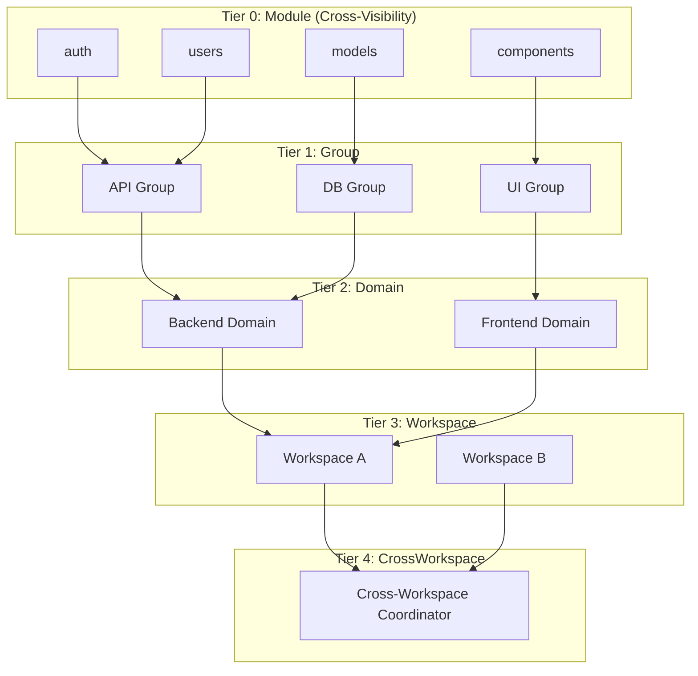
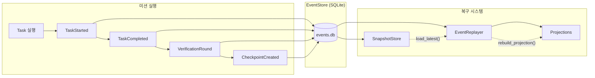
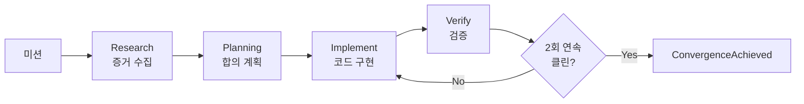

# Claude-Pilot

[](https://github.com/junyeong-ai/claude-pilot/actions)
[](https://www.rust-lang.org)
[](LICENSE)

> **[English](README.en.md)** | **한국어**

**AI 코딩 오케스트레이터** — 멀티 에이전트 합의 프로토콜과 이벤트 소싱으로 "완료"가 진짜 완료가 되도록 합니다.

---

## 왜 Claude-Pilot인가?

- **품질 보장** — 2회 연속 검증 통과 필수 (빌드/테스트/린트/리뷰)
- **일관성** — 계층형 합의 프로토콜로 멀티 에이전트가 조율
- **내구성** — 이벤트 소싱으로 중단점에서 즉시 재개

---

## 빠른 시작

```bash
# 설치
git clone https://github.com/junyeong-ai/claude-pilot.git
cd claude-pilot && cargo install --path .

# 프로젝트 초기화
cd your-project
claude-pilot init

# 미션 실행
claude-pilot mission "사용자 인증 기능 추가"
```

---

## 핵심 아키텍처

### 멀티 에이전트 합의 프로토콜



**합의 결과 (ConsensusResult):**
- `Agreed` — 전체 합의 달성, 계획 확정
- `PartialAgreement` — 과반 합의, 반대 의견 기록 후 진행
- `NoConsensus` — 합의 실패, 상위 Tier로 에스컬레이션

---

### 이벤트 소싱 기반 Replay/Resume



**주요 이벤트:**
| 이벤트 | 설명 |
|--------|------|
| `MissionCreated` | 미션 시작 |
| `ConsensusRoundStarted` | 합의 라운드 시작 |
| `TierConsensusCompleted` | Tier별 합의 완료 |
| `TaskCompleted` | 작업 완료 |
| `VerificationRound` | 검증 라운드 결과 |
| `CheckpointCreated` | 체크포인트 저장 |
| `SessionRecoveryStarted` | 세션 복구 시작 |

---

### 실행 흐름



**4 Phase:**
1. **Research** — `EvidenceGatheringStarted` → `EvidenceFileDiscovered` → `EvidenceGatheringCompleted`
2. **Planning** — `ConsensusRoundStarted` → `ConsensusVoteReceived` → `ConsensusRoundCompleted`
3. **Implement** — `TaskStarted` → `TaskCompleted` (충돌 시 `ConsensusConflictDetected`)
4. **Verify** — `VerificationRound` → `IssueDetected` → `IssueResolved` → `ConvergenceAchieved`

---

## 주요 기능

### 미션 실행
```bash
claude-pilot mission "OAuth 로그인 구현"           # 기본
claude-pilot mission "버그 수정" --isolated        # Worktree 격리 (권장)
claude-pilot mission "긴급 수정" --priority P1    # 우선순위
```

### 상태 & 제어
```bash
claude-pilot status                               # 현재 상태
claude-pilot list                                 # 미션 목록
claude-pilot pause mission-123                    # 일시정지
claude-pilot resume mission-123                   # 재개 (이벤트 리플레이)
claude-pilot retry mission-123                    # 실패 지점부터 재시도
```

### 완료 후
```bash
claude-pilot merge mission-123 --pr               # PR 생성
claude-pilot cleanup mission-123                  # Worktree 정리
```

---

## 설정

### 핵심 설정 (.pilot/config.toml)
```toml
[orchestrator]
max_iterations = 100
mission_timeout_secs = 604800      # 7일

[multi_agent]
enabled = true
parallel_execution = true

[multi_agent.consensus]
max_rounds = 5
enable_cross_visibility = true     # Tier 0에서 제안 공유

[recovery.convergent_verification]
required_clean_rounds = 2          # 필수 (변경 불가)
include_ai_review = true           # 필수 (변경 불가)

[state]
database_path = ".pilot/events.db"
enable_snapshots = true
snapshot_interval_events = 100
```

---

## 명령어 참조

| 명령어 | 설명 |
|--------|------|
| `init` | 프로젝트 초기화 |
| `mission <설명>` | 미션 시작 |
| `status [id]` | 상태 확인 |
| `list` | 미션 목록 |
| `pause <id>` | 일시정지 (CheckpointCreated) |
| `resume <id>` | 재개 (SessionRecoveryStarted) |
| `retry <id>` | 재시도 |
| `merge <id>` | 병합 |
| `cleanup [id]` | 정리 |

### 옵션
- `--isolated` — Worktree 격리 (권장)
- `--priority <P1|P2|P3>` — 우선순위
- `--pr` — PR 생성 (merge)
- `-o json` — JSON 출력
- `-v` — 상세 로그

---

## 문제 해결

### 디버그 (이벤트 확인)
```bash
# 이벤트 로그 조회
sqlite3 .pilot/events.db "SELECT event_type, timestamp FROM events ORDER BY global_seq DESC LIMIT 20;"

# 상세 로그
RUST_LOG=debug claude-pilot mission "..."
```

### 합의 미수렴
```toml
[multi_agent.consensus]
max_rounds = 10
enable_cross_visibility = true     # Tier 0 Cross-Visibility 필수
```

---

## 요구사항

- Rust 1.92.0+
- Git
- Claude Code CLI (OAuth 인증 완료)

---

## 지원

- [GitHub Issues](https://github.com/junyeong-ai/claude-pilot/issues)
- [개발자 가이드](CLAUDE.md)

---

<div align="center">

**[English](README.en.md)** | **한국어**

Made with Rust

</div>
