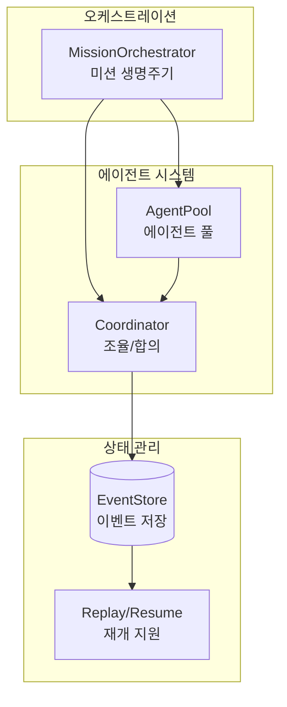
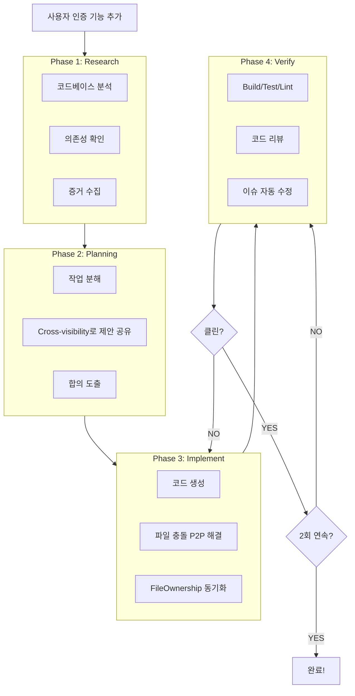
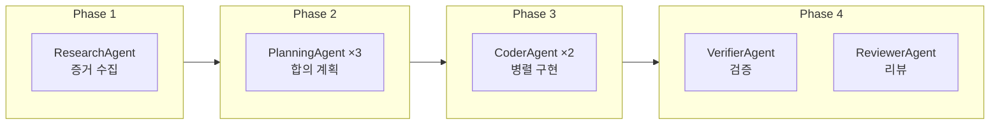
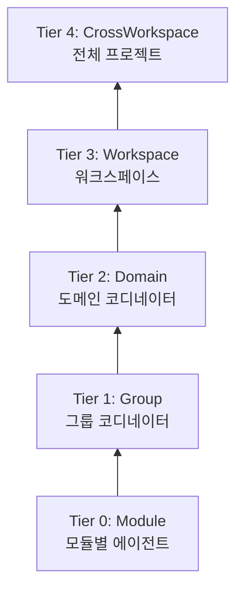
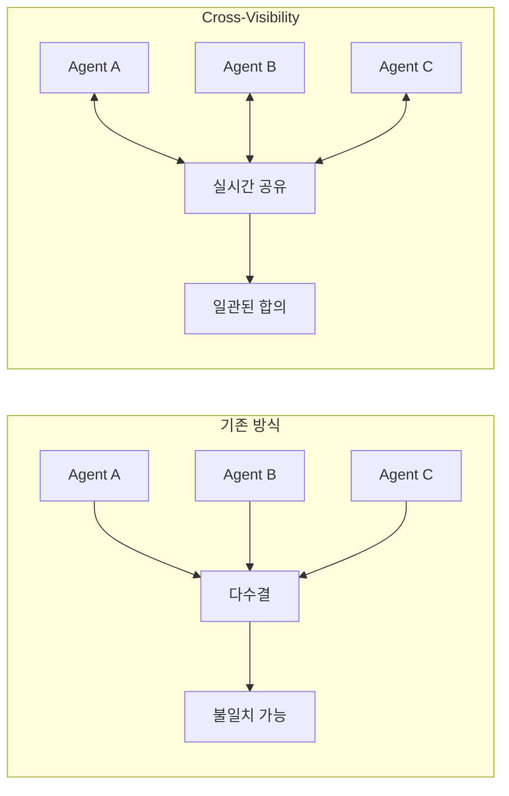
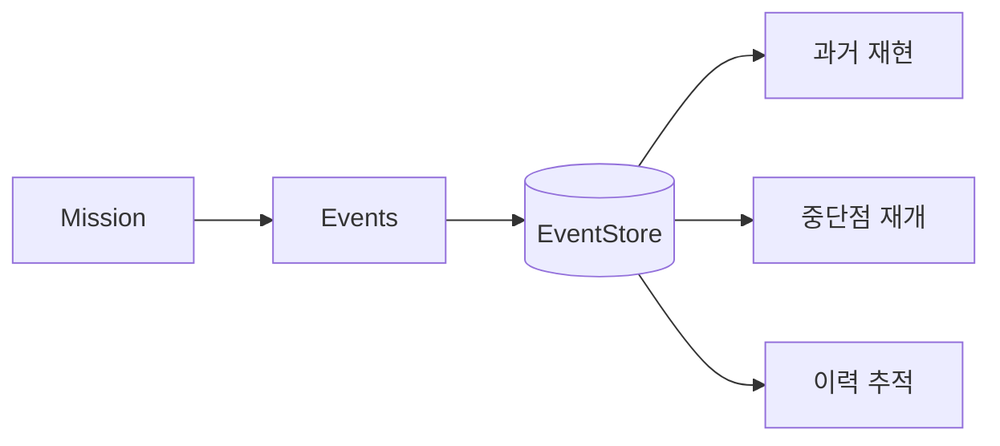
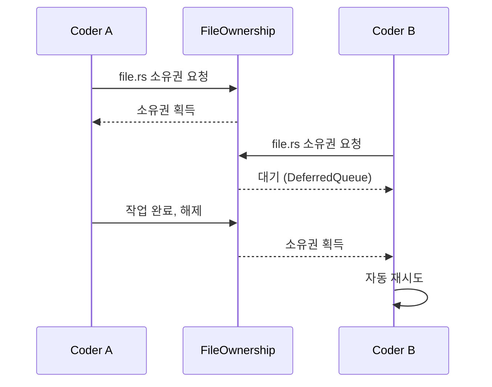
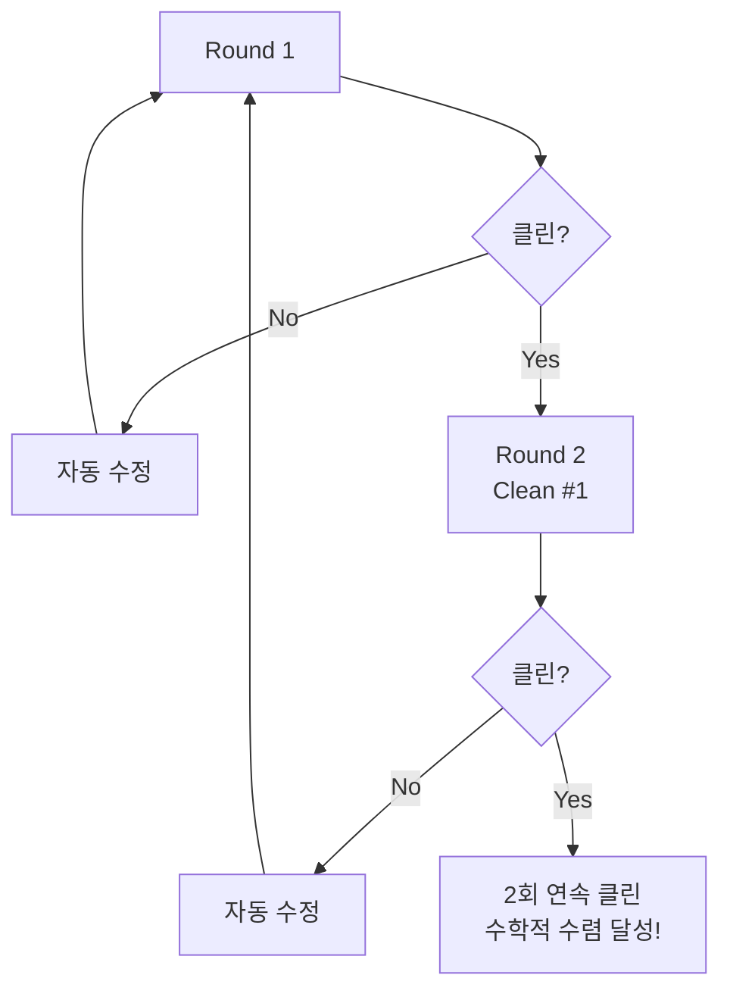

# Claude-Pilot

> AI 코딩 오케스트레이터 - 증거 기반 계획, 멀티 에이전트 합의, 수렴적 품질 검증으로 완벽한 코드를 만듭니다.

## 왜 Claude-Pilot인가?

| 기존 AI 코딩 | Claude-Pilot |
|-------------|--------------|
| ❌ 추측으로 코딩 | ✅ 증거 수집 후 계획 |
| ❌ "완료!" 후 버그 발견 | ✅ 2회 연속 검증 통과까지 반복 |
| ❌ 복잡한 작업에서 일관성 부족 | ✅ 멀티 에이전트 합의로 조율 |
| ❌ 중단되면 처음부터 다시 | ✅ 이벤트 소싱으로 중단점에서 재개 |

---

## 목차

- [빠른 시작](#빠른-시작)
- [핵심 개념](#핵심-개념)
- [실행 흐름](#실행-흐름)
- [CLI 명령어](#cli-명령어)
- [설정](#설정)
- [멀티 에이전트 시스템](#멀티-에이전트-시스템)
- [고급 기능](#고급-기능)
- [실제 사용 사례](#실제-사용-사례)
- [문제 해결](#문제-해결)

---

## 빠른 시작

### 요구사항

- Rust 1.92.0 이상
- Git
- Claude Code CLI 설치 및 OAuth 인증 완료

### 설치

```bash
git clone https://github.com/anthropics/claude-pilot.git
cd claude-pilot
cargo build --release
cargo install --path .
```

### 첫 미션 실행

```bash
# 1. 프로젝트 초기화
cd your-project
claude-pilot init

# 2. 미션 시작
claude-pilot mission "사용자 인증 기능 추가"
```

### 격리 모드

```bash
# Worktree 격리 (권장) - 별도 디렉토리에서 작업
claude-pilot mission "버그 수정" --isolated

# 브랜치 격리 - 새 브랜치에서 작업
claude-pilot mission "리팩토링" --branch

# 직접 모드 - 현재 브랜치에서 바로 작업
claude-pilot mission "문서 업데이트" --direct
```

---

## 핵심 개념

### 아키텍처



### 3가지 핵심 보장

| 보장 | 설명 | 구현 |
|------|------|------|
| **품질 보장** | 2회 연속 검증 통과 필수 | ConvergentVerifier |
| **일관성 보장** | 멀티 에이전트 합의 | Cross-Visibility Consensus |
| **내구성 보장** | 중단점에서 재개 가능 | Event Sourcing (SQLite) |

---

## 실행 흐름



---

## CLI 명령어

### 미션 관리

| 명령어 | 설명 |
|--------|------|
| `claude-pilot init` | 프로젝트 초기화 |
| `claude-pilot mission "<설명>"` | 미션 시작 |
| `claude-pilot status [mission_id]` | 상태 확인 |
| `claude-pilot list` | 모든 미션 목록 |
| `claude-pilot logs <mission_id>` | 로그 확인 |

### 미션 제어

| 명령어 | 설명 |
|--------|------|
| `claude-pilot pause <mission_id>` | 일시정지 (체크포인트 저장) |
| `claude-pilot resume <mission_id>` | 중단점에서 재개 |
| `claude-pilot cancel <mission_id>` | 취소 |
| `claude-pilot retry <mission_id>` | 실패 지점부터 재시도 |

### 완료 후 작업

| 명령어 | 설명 |
|--------|------|
| `claude-pilot merge <mission_id>` | 메인에 병합 |
| `claude-pilot cleanup [mission_id]` | Worktree 정리 |

### 주요 옵션

```bash
--isolated              # Worktree 격리 모드 (권장)
--branch                # 브랜치 격리 모드
--direct                # 현재 브랜치에서 작업
--priority <P1|P2|P3>   # 우선순위 (P1=긴급)
-o json                 # JSON 출력
-o stream               # 실시간 스트리밍
-v, --verbose           # 상세 로그
```

---

## 설정

### 설정 파일 위치

```
your-project/
├── .pilot/
│   ├── config.toml       # 프로젝트 설정
│   └── events.db         # 이벤트 저장소
└── .claudegen/
    └── manifest.json     # 모듈 구조 정의
```

### 핵심 설정 (.pilot/config.toml)

```toml
# 기본 설정
[orchestrator]
max_iterations = 100
mission_timeout_secs = 604800  # 7일

# 멀티 에이전트
[multi_agent]
enabled = true
parallel_execution = true

[multi_agent.instances]
research = 1
planning = 3      # 합의용
coder = 2         # 병렬 구현
verifier = 1

# 합의 설정
[multi_agent.consensus]
max_rounds = 5
enable_cross_visibility = true
flat_threshold = 3        # 3명 이하 → 단일 라운드
hierarchical_threshold = 10

# 수렴적 검증 (변경 불가)
[recovery.convergent_verification]
required_clean_rounds = 2  # 필수
include_ai_review = true   # 필수

# 이벤트 저장소
[state]
database_path = ".pilot/events.db"
enable_snapshots = true
```

### 모듈 구조 정의 (.claudegen/manifest.json)

```json
{
  "project": {
    "name": "my-project",
    "modules": [
      {
        "id": "auth",
        "name": "인증 모듈",
        "paths": ["src/auth/"],
        "dependencies": ["models"],
        "responsibility": "사용자 인증 및 권한 관리"
      }
    ]
  }
}
```

---

## 멀티 에이전트 시스템

### 에이전트 역할



### 계층형 합의



### Cross-Visibility 합의



---

## 고급 기능

### 이벤트 소싱 & 재개



**사용 예시:**
```bash
# 중단된 미션 재개
claude-pilot resume mission-123

# 실패한 미션 재시도
claude-pilot retry mission-123

# 특정 체크포인트에서 재개
claude-pilot resume mission-123 --checkpoint cp-456
```

### P2P 충돌 해결



### 수렴적 검증 (2-Pass)



---

## 실제 사용 사례

### 신규 기능 개발

```bash
claude-pilot mission "OAuth2.0 소셜 로그인 구현" --isolated
claude-pilot status
claude-pilot merge --pr
```

### 긴급 버그 수정

```bash
claude-pilot mission "결제 실패 롤백 누락 수정" --priority P1 --direct
claude-pilot merge --direct
```

### 대규모 리팩토링

```bash
claude-pilot mission "인증 시스템 JWT→Session 전환" \
  --isolated --on-complete pr

# 실시간 상태 확인
claude-pilot -o stream status
```

### 중단된 미션 재개

```bash
claude-pilot list
claude-pilot resume mission-2024-01-15-abc123
```

---

## 문제 해결

### 자주 발생하는 문제

#### 미션 타임아웃

```toml
[multi_agent.consensus]
total_timeout_secs = 3600  # 1시간으로 증가

[orchestrator]
mission_timeout_secs = 86400  # 1일로 증가
```

#### 합의 미수렴

```toml
[multi_agent.consensus]
max_rounds = 10
enable_cross_visibility = true  # 반드시 활성화
```

#### 검증 무한 루프

```toml
[recovery.convergent_verification]
max_rounds = 5
max_fix_attempts_per_issue = 3
```

#### Worktree 정리

```bash
claude-pilot cleanup mission-123
claude-pilot cleanup --all
```

### 디버깅

```bash
# 상세 로그
claude-pilot -v mission "..."

# 더 상세한 로그
RUST_LOG=debug claude-pilot mission "..."

# JSON 상태 확인
claude-pilot -o json status mission-123

# 이벤트 로그 조회
sqlite3 .pilot/events.db "SELECT * FROM events ORDER BY timestamp DESC LIMIT 20;"
```

---

## 개발

### 빌드 & 테스트

```bash
cargo build --release
cargo test --lib
cargo clippy
```

### 프로젝트 구조

```
claude-pilot/
├── src/
│   ├── agent/multi/      # 멀티 에이전트 핵심
│   ├── orchestration/    # 미션 오케스트레이션
│   ├── state/            # 이벤트 소싱
│   └── verification/     # 검증 시스템
├── tests/                # 통합 테스트
├── CLAUDE.md             # AI 개발 가이드
└── README.md             # 사용자 가이드
```

---

## 라이선스

MIT License

---

## 버전

- Rust Edition: 2024
- MSRV: 1.92.0
